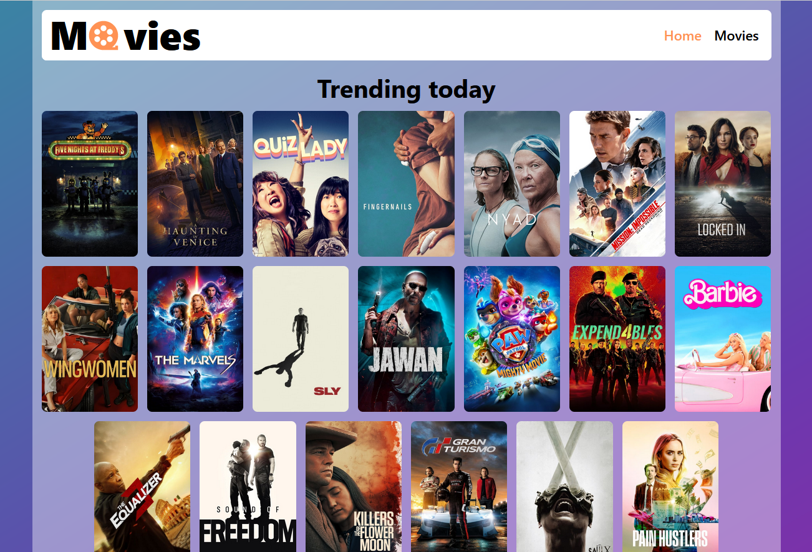

# Movies

## Description
* This is a pet project developed for basic routing for a movie search and storage application.
* The program allows users to search for movies using The Movie Database (themoviedb.org) API and store them.
* Implemented asynchronous loading of JS code for application routes.
* Created routing with the React Router library using React.lazy() and Suspense for lazy loading.

## Technologies
The following technologies are applied in this project:
- React
- React hooks
- JavaScript
- Axios
- The Movie Database (themoviedb.org) API
- React.lazy()
- Suspense